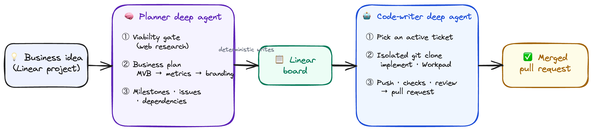
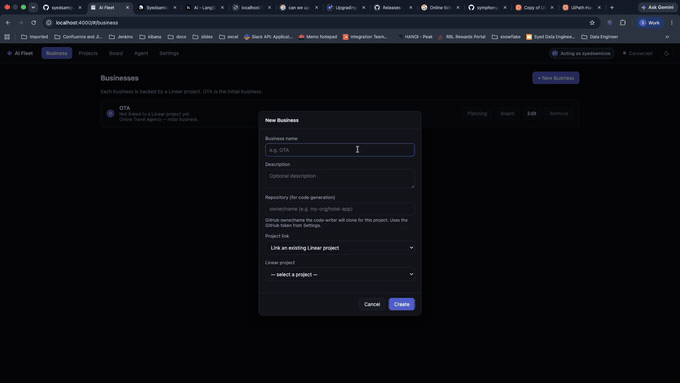
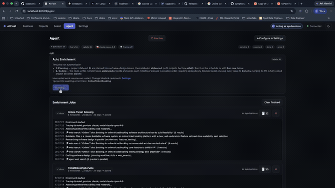
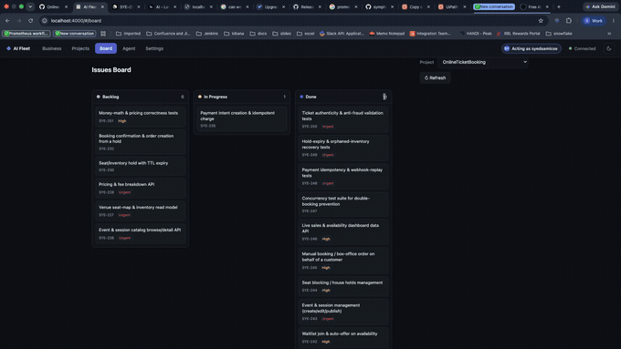
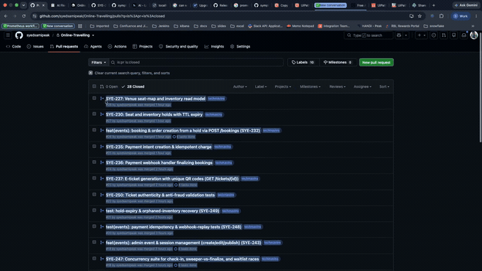
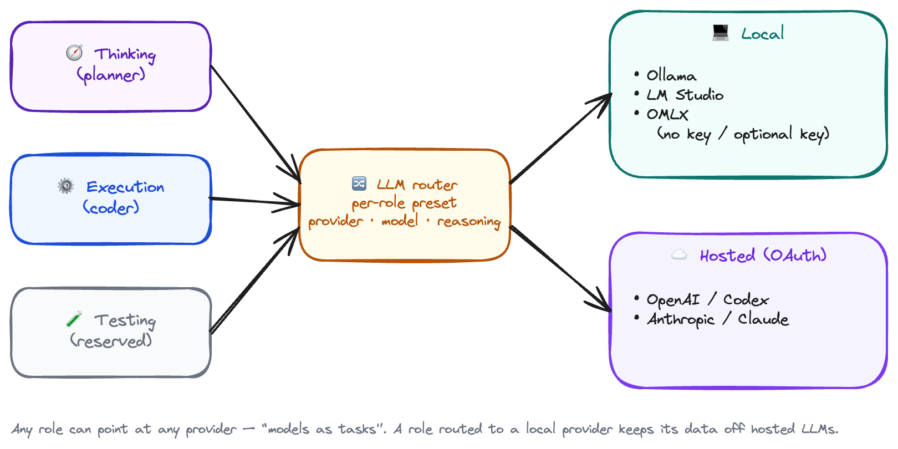
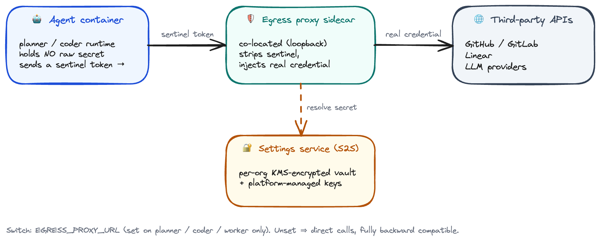
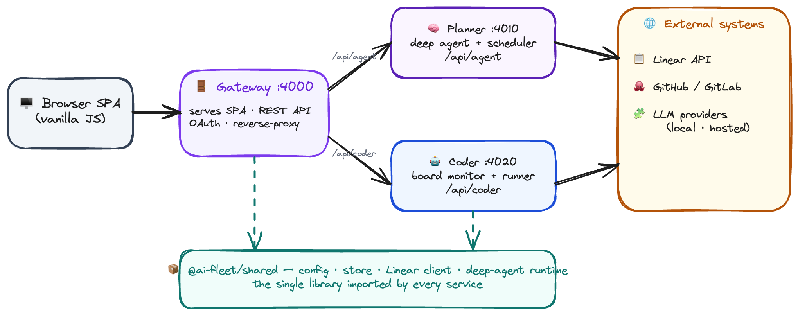

# AI Fleet

<p align="center">
  <a href="./EULA.md"></a>
  = 22">
  <a href="https://modelcontextprotocol.io/"></a>
  
  
  
</p>

<!--
  These badges are STATIC so they render on a private repo. When this repo becomes
  public (and is registered on trendshift.io), you can add the live/trending badges:
  [](https://trendshift.io/repositories/XXXXX)
  [](https://github.com/niravshah2705/symphony/actions/workflows/checks.yml)
  [](https://github.com/niravshah2705/symphony/stargazers)
-->

> **From a business idea to a merged pull request** — a fleet of deep agents that plan
> the business and ship the code.

**AI Fleet** is a microservice-decomposed Node.js app that manages Linear projects and
runs two isolated **deep agents** over one shared library: a **business-owner planner**
that turns a project into a validated plan (milestones, issues, dependencies), and a
**code-writer** that drives a single ticket end-to-end to a pull request — each powered
by local (Ollama / LM Studio / OMLX) or hosted (Codex / Claude) models.

> **New here?** Start with the [Developer Onboarding guide](docs/DEVELOPER_ONBOARDING.md)
> — prerequisites, start commands, first-run config, and the code map.

## How it works

<p align="center">
  
</p>

<sub>Diagram source: <a href="diagrams/how-it-works.excalidraw"><code>diagrams/how-it-works.excalidraw</code></a> (editable in <a href="https://excalidraw.com">Excalidraw</a>).</sub>

The **planner** enriches labelled projects on a schedule; the **coder**'s board monitor
polls active tickets and drives each to a PR. Everything is traced end-to-end (LangSmith)
and every LLM write is schema-validated before it touches Linear.

## Quick start

```bash
npm install        # installs all workspaces
npm start          # boots the local services plus isolated egress/token helpers
```

Then open <http://localhost:4000>, go to **Settings**, and paste a Linear **personal API
key** (create one at <https://linear.app/settings/api>). See [Run](#run) for options and
[Using it](#using-it) for the full first-run walkthrough.

## Features

- **Projects** — project list + a **milestone planning view** (timeline of milestones with issues grouped under each).
- **Board** — Linear issues shown as a Kanban **board** by workflow state, with drag-and-drop to move issues between columns.
- **Business** — a Business tab where each business is backed by a Linear project in the background. **OTA** is pre-seeded as the initial business.
- **Agent** — a **business-owner planning deep agent** (Ollama, LM Studio, OMLX, Codex, or Claude + web search) enriches projects **carrying any of the chosen labels** (default `AI`): it checks business viability (unfit → `aifail`), writes a business plan — **MVB** (Minimal Viable Business) first, then business metrics, branding, and beyond — creates milestones, tasks, and dependencies, and marks the project **`aidone`** once issues exist. Interrupted projects **resume on restart** (missing issues get created). Projects are **discovered and processed on a configurable 5/10/15-minute schedule**.
- **Code-writer agent** — a second deep agent that works a **single Linear ticket end-to-end** inside an **isolated git clone**: it implements the change, keeps one **`## Workpad`** comment as the source of truth, and drives the ticket through its state machine to a **pull request** (stamped with a configurable label). A board monitor polls active-state tickets and dispatches runs up to a concurrency cap. See [Code-writer agent](#code-writer-agent) below.
- **Settings** — a guided page with a configuration-health overview and category navigation for **Models & runtime**, **Connections**, **Automation**, and **Identity**. **Models & runtime** holds **Task Models** — a **Thinking**, **Execution**, and **Testing** model (provider, model, and model-aware reasoning per role). Local server address and authentication sit in the primary model flow; less common tuning remains collapsed. All secrets are validated/stored **server-side** and never returned to the browser.
- **Agent activity omnibox** — one intent-aware entry point routes greetings, bounded workspace/document search, business evaluation, safe-policy responses, troubleshooting, general planning, and confirmed implementation-task creation. Route-specific evidence and actions stay in the side panel.
- **Organization workflow designer** — compose browser-local ADLC diagrams from curated or custom agents, Dev/Beta/Prod execution contexts, and role-based human approvals. Five realistic examples cover gated releases, research, commercial launch, incident response, and independent operations; diagrams are intentionally non-executable prototypes.
- **Agentic call recorder** — record a shared screen or camera with microphone audio, review/download the recording locally, and use the configured local model to organize typed call notes. Recording media never leaves the browser.
- **Local trace analysis** — paste logs or a structured agent trace and get a concise explanation, evidence, bottlenecks, and next actions from the configured Ollama, LM Studio, or OMLX model.
- **Tool integrations** — choose **GitHub or GitLab** as the repository host and save a default repository/token; choose **Linear, Jira, or Asana** as the planning connector in Settings. A server-side repository broker owns authenticated clone/fetch/push and PR/MR/check/merge calls through the providers' official APIs. Existing live project/board automation remains Linear-backed while the additional planning credentials provide the configuration surface for connector routing.
- **Multilingual workspace** — the gateway uses coarse IP location plus the browser's BCP 47 language preferences to suggest at most five useful languages. English and Gujarati remain available. Menu text has immediate built-in English/Gujarati/Hindi copy; the configured local Ollama, LM Studio, or OMLX model translates the rest of the UI, including internal status text and visible attributes, without sending it to a hosted provider.
- **Runtime and workflow controls** — choose DeepAgent, the official Codex SDK, or the Claude Agent SDK, plus sequential, fan-out, evaluator, or supervisor guidance for new compatible runs. Every effective runtime receives a LangSmith root trace when tracing is enabled.
- **Operations** — Analytics shows per-change trace cost, tokens, latency, and failures from LangSmith without treating missing telemetry as zero. Troubleshooting performs secret-free readiness checks for services, local inference, integrations, SDK packages, and tracing. The desktop navigation collapses to an accessible icon rail.

## Demo

AI Fleet in action — from creating a business to shipping merged PRs:

**1. Create a business** — each business is backed by a Linear project.



**2. The planning deep agent runs** — viability check and web research, then milestones, tasks, and dependencies.



**3. Issues land on the board** — AI-generated issues grouped by workflow state.



**4. The code-writer agent ships PRs** — each ticket driven end-to-end to a merged pull request.



## Settings

<p align="center">
  
</p>

<sub><b>Task Models</b> — each role (Thinking / Execution / Testing) can point at any local or hosted provider ("models as tasks").</sub>

Collapsible sections:

1. **Scope vault & connections** — organization administrators store provider credentials in the encrypted organization vault, with optional per-project overrides. Linear is customer-owned and has no process-wide or platform-managed fallback. The UI exposes only masked presence/source metadata and connector readiness.
2. **Tool integrations** — choose a planning connector (**Linear / Jira / Asana**) and repository host (**GitHub / GitLab**), then save non-secret connector metadata separately from credentials. Agent containers send sentinel credentials to their loopback egress proxy; only the proxy resolves and injects the selected organization/project vault value.
3. **Task Models** — choose **Provider**, **Model**, and **Reasoning** for each task role ("models as tasks"): **Thinking** (planner), **Execution** (coder), **Testing** (tester), and **Deployment** (deployer). Each role picks any provider — local (Ollama / LM Studio / OMLX) or hosted (OpenAI / Anthropic). Selecting a model atomically applies its recommended context, output, sampling, and provider-native reasoning defaults. Expand **Customize parameters** to change supported numeric values later.
   - **Ollama / LM Studio / OMLX (local)** — the page renders immediately, discovers available models asynchronously, and offers a refresh action. In proxied deployments their network origins are trusted operator configuration on the proxy, never browser-selected targets. Ollama and LM Studio require no key; an optional OMLX key belongs in the scope vault. LM Studio's configured context must match the context used when loading the model, and its output budget is capped at half that context so prompt and output fit together.
   - **OpenAI / Codex** — browser OAuth is intentionally disabled. An organization administrator imports a Codex token bundle out of band with `adlc admin codex import --org-id <uuid> --settings-url <url>` (stdin by default, or `--token-file`); the IAM-gated settings service encrypts it in the org vault. The browser exposes status/model selection only and never receives the bundle.
   - **Anthropic / Claude OAuth** — **Sign in with Claude**, approve in the opened tab, then paste the returned `code#state`. Available models are queried from Anthropic with bundled fallbacks, and only each model's advertised adaptive-thinking effort values are shown.

The committed source of truth is [`packages/shared/src/agent/llm-presets.json`](packages/shared/src/agent/llm-presets.json). It separates model limits from request defaults and records the exact reasoning adapter used by each provider.

For **OMLX**, start the server with at least one model or profile available, then
select an OMLX preset. Its default origin is `http://127.0.0.1:8000`; Settings
accepts either that origin or `http://127.0.0.1:8000/v1` and stores the normalized
origin. Model discovery calls the server's OpenAI-compatible `GET /v1/models`
endpoint. If the server was started with API-key protection, enter the key in the
OMLX connection card; it remains masked and server-side.
4. **Agent runtime & workflow** — select a default and optional per-stage harness for planning, coding, testing, and deployment, then choose bounded sequential/fan-out/evaluator/supervisor guidance. Only catalog entries marked available are selectable; OpenCode, Pi, Oh My Pi, and DeepSeek remain experimental metadata until reviewed runtime executors exist. DeepAgent remains the full brokered Linear + GitHub/GitLab lifecycle. SDK runtimes operate only with a compatible hosted provider and never receive application-owned tracker or repository credentials.
5. **Assume Role** — pick a workspace member (validated server-side). The assumed role owns enriched projects and is shown in the **top toolbar**.
6. **Deep Agent** — **enrich labels** (multi-select dropdown of your Linear project labels), **scheduler cadence** (5 / 10 / 15 minutes), parallelism, and per-run/milestone/issue caps, plus toggles.

The top-bar language picker intentionally shows a small suggestion set rather than a complete language catalog. Location lookup retains only country code and region; no IP address is returned to the browser or persisted. If the local translator is unavailable, the UI shows a warning and retries with bounded backoff instead of silently treating English fallback text as translated.

## Agent SDKs, workflows, and tracing

- **DeepAgent** is the default and the only runtime that receives the private Linear MCP and provider-neutral repository broker tools required for the unattended ticket-to-merged-review lifecycle.
- **Codex SDK** runs official server-side Codex threads in the prepared workspace. The admin-imported org token bundle is staged in a per-run private home and removed after the run; model-initiated shells do not inherit the credential.
- **Claude Agent SDK** runs the official Claude loop with persistent sessions disabled. Its built-in Bash tool is withheld when OAuth is present so the credential cannot leak into model-initiated commands.
- **Workflow patterns** are bounded orchestration guidance applied to one runtime session. Capable SDKs may delegate independent investigation, but the setting does not promise concurrent workers, automatic evaluator retries, or brokered handoffs.
- **LangSmith tracing** wraps each effective runtime at the root and records provider/model/runtime/pattern plus available token usage. Claude-reported cost is attached directly; otherwise LangSmith can calculate cost when it has matching model pricing. Unknown cost remains unavailable (`—`), never synthetic `$0.00`.

## Durable fixed pipeline

When `PIPELINE_ORCHESTRATOR_ENABLED=true`, new starts use a versioned, durable
`plan → code → test → deploy` control plane. The gateway performs EULA, billing,
user-scoped policy, harness, model, and credential-readiness preflight once, then
persists only the secret-free decision. The LangGraph orchestrator advances from
typed `StageCommandV1`/`StageResultV1` messages with stable run, attempt, and
idempotency identifiers. Firestore stores pipeline/stage state and graph
checkpoints in Cloud Run; Linear labels are best-effort visibility projections,
not completion events. Each worker also claims the command idempotency key in a
durable execution store and persists its typed result before publishing it, so
a restart replays the same result instead of rerunning side effects. An expired
execution lease is terminally recovered as an unknown outcome; it is never
blindly reacquired. Local development uses an atomic JSON file (memory under
unit tests), while production workers fail startup unless the backend is
Firestore.

The wire contract caps raw `StageCommandV1` JSON at 256 KiB, caller request data
at 64 KiB, a stage-result output at 32 KiB, and a whole result at 48 KiB. Worker
HTTP parser limits include the calculated base64 expansion plus bounded Pub/Sub
envelope headroom. Commands and results each use four stage-specific topics;
publisher IAM grants a worker only its own result topic, whose subscription is
bound to `/pubsub/pipeline-stage-results/{stage}`.

Repository-native tester commands run through the image's
`ai-fleet-network-sandbox` launcher. Its no-new-privileges seccomp policy permits
local Unix-socket IPC but denies internet, link-local metadata, packet, raw, and
netlink sockets for the complete descendant process tree. The same launcher is
mandatory for the server-owned first test pass and every tester model tool; a
missing or unsupported launcher fails the check closed. This is the workload-
identity boundary between untrusted repository scripts and the tester/proxy
Cloud Run service account.

The rollout flag defaults off and preserves the legacy planner/coder paths. When
enabled, legacy label polling is disabled to prevent double dispatch. Deployment
has a second default-off gate (`PIPELINE_DEPLOYMENT_ENABLED=false`), accepts only
the exact full four-stage sequence, requires a successful tester result, and
uses a server approval for production plus repository-owned, allowlisted CI/CD
from `.ai-fleet/deployment.json`. The deployer receives neither raw CI credentials
nor an unrestricted deployment shell. The local Workflows canvas remains a
non-executable draft designer and is not a second pipeline schema.

When a run reaches `awaiting_approval`, an organization administrator can run
`adlc admin deploy approve` with the run, project, repository, environment, and
settings URL. The CLI reads the scoped run status and binds the approval to the
exact successful test command, commit/tree SHAs, and preflight digest before the
orchestrator can claim the deploy command.

Shared-stack pipeline admission accepts platform-managed provider credentials
only. A customer-selected credential is admitted only on the matching dedicated
deployment (`FLEET_ORG_ID`, with its proxy pinned by `PROXY_ORG_ID`), because a
shared proxy has no trustworthy per-request organization selector. Managed
hosted LLMs require the corresponding enabled Secret Manager version mounted on
the settings service through `managed_provider_secrets`.

Dedicated tenant proxies also receive a one-organization S2S bearer derived by
the provisioner. Settings verifies that bearer against the organization in the
vault route; the HMAC root exists only in settings and the provisioner, never in
an agent or proxy container. A compromised tenant runtime therefore cannot use
its proxy identity to resolve or rotate another organization's credentials.

## Local workspace scenarios

- **Workflows** (`#/workflows`) is an organization-scoped, freeform ADLC designer. Organization admins can drag or keyboard-add agents, contexts, and human gates; draw acyclic dependencies; keep independent roots on one canvas; and define guarded custom profiles. Drafts use a versioned `localStorage` key per organization, never sync to the server, and do not execute agents.
- **Agent workspace** (`#/agent`) is an omnibox for workspace activity. It routes salutations directly; searches bounded README/docs, business records, projects, and run history; checks diagnostics and recent log signals for troubleshooting; and turns implementation changes into reviewable project-task drafts. Business requests move through fraud signals, revenue metrics, business memory, architecture, thinker/spec breakdown, a UI-design handoff, and the existing scheduler. The center stays conversational while route-specific evidence and confirmed actions appear in the side panel.
- **Agent jobs** (`#/agent-jobs`) restores the complete operational history as separate planner and coding lists. It shows every retained job, lazily expands step activity, links to traces/tasks, refreshes live, and supports guarded per-job or finished-history cleanup.
- **Call recorder** (`#/calls`) uses browser `MediaRecorder` APIs for screen/camera + microphone capture. The generated media stays in a local Blob URL for review/download. Only typed notes and small metadata such as duration are sent to local enrichment.

## Agent tab (project enrichment)

- **Auto Enrichment** — open projects (no lead) carrying any selected label are **picked up automatically** on the schedule. The Agent tab shows a read-only preview of what the next run will process and a **Run now** button; there is no manual project list. Assume a role in **Settings** first (the section is disabled and server-enforced until then). For each project the deep agent:
  - generates a validated plan (description + milestones + dates + issues + dependencies) under **LangSmith tracing**;
  - the server deterministically applies it to Linear using your **existing Linear token**: assign lead, update description, create milestones (start date preserved in the milestone note, target date = stop date), create issues per milestone, and create `blocks` dependencies.
- **Agent jobs page** — live planner/enrichment and coding status (pending → running → done/error), per-job **Trace** and task links, expandable activity, and guarded per-job/finished cleanup.

### How the deep agent works (business-owner planner)

The agent plans **as a business owner**, not a software PM — it does **not** produce a software development lifecycle. It is built on `deepagents` (LangGraph), provider-specific LangChain clients for Ollama, LM Studio, OMLX, OpenAI, and Anthropic, plus keyless **web search** (DuckDuckGo); tracing uses the `langsmith` SDK. Steps, all traced and recorded on the job:

1. **Viability gate** — web-researches the domain and decides whether the project is a business product that can be delivered as a software-driven solution. **If not viable**, it appends a note to the project description and switches the project's label to **`aifail`** (removing the enrich label, so it isn't retried) — no milestones are created.
2. **Business plan** — if viable, it web-researches each phase and drafts business milestones in order:
   - **MVB — Minimal Viable Business** (first): the smallest workable product; tasks are the essential **features** to launch.
   - **Business Metrics**: the KPIs to instrument (acquisition, activation, retention, revenue).
   - **Branding**: brand identity & presence.
   - then further business milestones (Go-to-Market, Monetization, Growth).
   Every **milestone** gets a measurable **evaluation criterion** (success/exit criteria, appended to the milestone description as `**Evaluation criteria:** …`), and every **feature/issue** gets an **acceptance criterion** (definition of done, appended to the issue description as `**Acceptance criteria:** …`). Resume runs add these to existing milestones too.
3. The selected provider emits the plan using its configured structured-output or prompt-driven JSON mode; it is validated with Zod and clamped. The **server performs all Linear writes** (deterministic guardrail).

**Label lifecycle & resume.** A project is *managed* while it carries the enrich label (default `AI`). On completion its label is switched (replacing the enrich label, so it drops out of discovery):
- **`aidone`** — once the project's issues have been created.
- **`aifail`** — when the viability check fails.

If a run is interrupted after milestones are created but before issues (crash/restart), the project keeps the enrich label. On the next tick — and **immediately on restart** — the agent **reviews the existing milestones and creates the missing issues** (researching tasks per milestone), then marks the project `aidone`. Milestones that already have issues are left untouched (no duplicates).

- **Local-first (Ollama, LM Studio, or OMLX):** run a tool-capable model locally and choose its preset. Point any task role (Thinking / Execution / Testing) at a local provider and nothing is sent to a hosted LLM for that role. Ollama receives `think`; compatible LM Studio and OMLX runtimes receive their provider-native reasoning controls.
- **Codex (OpenAI) provider:** the same deep-agent pipeline runs against OpenAI (`@langchain/openai` → `ChatOpenAI`) when the hosted preset is Codex, authenticated by the OAuth flow above. The ChatGPT backend uses Responses-format JSON and reasoning effort; tokens are refreshed on demand before each run.
- **Claude (Anthropic) provider:** the same pipeline runs against Anthropic (`@langchain/anthropic` → `ChatAnthropic`) when the active provider is **Claude**, authenticated by the Claude OAuth flow above (subscription bearer token + `anthropic-beta` header). Tokens are refreshed on demand before each run.
- **Web search** runs **in parallel**: the deep agent's `web_search` tool takes an array of queries and fans them out concurrently, and the per-phase / per-milestone research searches are issued together (`webSearchMany` → `Promise.all`). Results are untrusted and fenced as data in prompts (prompt-injection defense), like Linear content.

## Code-writer agent

A second deep agent (a focused equivalent of OpenAI Symphony, built on `deepagents`
instead of Codex) works a **single Linear ticket end-to-end** inside an **isolated
git clone** and drives it to a pull request. It reuses the same LLM provider chosen
in **Task Models** (each of Thinking / Execution / Testing picks any local Ollama/LM Studio/OMLX or hosted Codex/Claude model).

- **One attempt per ticket** (`packages/shared/src/agent/coder.js`) — the agent runs in an
  isolated workspace (a per-ticket clone under `CODER_WORKSPACE_ROOT`). It has
  filesystem + shell tools (rooted at the clone), an injected **`linear_graphql`**
  tool (the raw Linear token stays server-side — the agent never sees it), and a
  scoped **`repository_broker`** tool for GitHub/GitLab fetch, push, review status,
  checks, and squash merge (the repository token also stays server-side), plus a
  set of **skills** (`linear`, `commit`, `push`, `pull`, `land`) loaded from
  `packages/shared-core/src/agent/skills/`. Its system prompt is the **workflow** (ticket state
  machine + a single `## Workpad` comment as the source of truth).
- **Board monitor** (`packages/shared/src/agent/coder-orchestrator.js`) — on a fixed cadence it
  polls the tracker for tickets in an **active state**
  (`Todo, In Progress, Merging, Rework` by default) and dispatches a code-writer
  run per ticket, up to a global concurrency cap. State is in-memory and re-derived
  from the tracker on restart (single-writer model: a ticket is never dispatched
  twice concurrently). It does **not** start automatically — start it via the API.

### Configuring the code-writer

All values are env-overridable (`CODER_*`, see `packages/shared/src/config.js`):

| Env var | Default | Purpose |
| ------- | ------- | ------- |
| `CODER_REPO_URL` | *(empty)* | Repository the agent clones per ticket (**required**). |
| `CODER_WORKSPACE_ROOT` | `~/code/techmavins-workspaces` | Where isolated clones live. |
| `CODER_ACTIVE_STATES` | `Todo,In Progress,Merging,Rework` | Ticket states the monitor acts on. |
| `CODER_TERMINAL_STATES` | `Done,Closed,Cancelled,Canceled,Duplicate` | States left alone. |
| `CODER_MAX_TURNS` | `40` | `deepagents` recursion budget per run. |
| `CODER_MAX_CONCURRENT` | `3` | Max tickets worked concurrently. |
| `CODER_POLL_INTERVAL_MS` | `15000` | Board-monitor poll cadence. |
| `CODER_SHELL_TIMEOUT_SEC` | `600` | Shell command timeout in the workspace. |
| `CODER_PR_LABEL` | `techmavins` | Label stamped on the agent's PRs. |

### Running the code-writer

```bash
# status + in-flight tickets
curl http://localhost:4000/api/coder

# run the code-writer on ONE ticket (async — watch the logs / Linear Workpad)
curl -X POST http://localhost:4000/api/coder/run \
  -H 'content-type: application/json' -d '{"issueId":"<issue-uuid>"}'

# start / stop the board monitor
curl -X POST http://localhost:4000/api/coder/monitor \
  -H 'content-type: application/json' -d '{"action":"start"}'
```

Progress is reported to the server logs (`data/app.log`) and to the ticket's
`## Workpad` comment in Linear.

`CODER_BACKEND=openswe` is a legacy GitHub-only adapter configured on the OpenSWE
side (`OPENSWE_REPO`/`CODER_REPO_URL`); it does not use the local repository broker
or the selected repository setting. A GitLab selection therefore fails closed.
Use the default local backend for brokered GitHub/GitLab operation.

## Security notes

<p align="center">
  
</p>

- **Role assumption is enforced server-side** — enrich endpoints return `403` without an assumed role; the assumed member id is validated against the real workspace member list.
- **EULA acceptance gates "actual work"** — the omnibox answers read-only RAG questions freely, but scheduling enrichment (`/api/agent/enqueue`), preparing a business (`/api/agent/business/prepare`), and creating an implementation task (`POST /api/issues`) return `403 EULA_REQUIRED` until the caller accepts the [EULA](./EULA.md). Acceptance is recorded per user (keyed by verified identity) and per organisation; **members of an organisation are considered already accepted**. Decisions (including rejections) persist in the shared store and the version is tracked, so a user is asked exactly once per EULA version. The API is the trust boundary — the gate is enforced server-side, not only in the SPA.
- **Secrets stay on the server** — Linear/LangSmith keys, the optional **OMLX API key**, and **Codex/Claude OAuth tokens** live only in `data/store.json`, are masked in API responses, and are never sent to the browser. Ollama needs no key.
- **Repository credentials are brokered** — stored GitHub/GitLab tokens never enter the code agent's `LocalShellBackend` environment, prompt, tool arguments, origin URL, or `.git/config`. Authenticated Git executes from a broker-private bare staging repository with a fixed host/repository/branch/refspec; PR/MR creation, check/review reads, and SHA-checked squash merge use the official GitHub/GitLab HTTP APIs. Provider redirects, arbitrary URLs/refspecs, force pushes, and broad GitHub MCP access are denied.
- **Local shell trust boundary** — `LocalShellBackend` is a host shell rooted by convention, not an OS security sandbox. It runs with the coder service user's filesystem permissions and can read other paths that user can access (including the plaintext local store if it discovers its path). Environment sanitization and the repository broker prevent routine credential injection, but do not contain adversarial shell code. Run the coder only for trusted repositories/tickets in this local deployment; stronger isolation requires a separate container/VM or OS identity with a narrowly mounted workspace and an external secret broker.
- **Codex credentials** — browser OAuth/login and sign-out routes are tombstoned. The operator CLI sends a bounded token bundle directly to the IAM-gated settings service, which requires an authenticated org-admin principal and encrypts the bundle in the organization vault. Refresh rotation uses compare-and-swap so a stale worker cannot overwrite newer tokens. Browser-settable model overrides remain allowlisted and model-family checked.
- **Claude OAuth** — the same Authorization Code + **PKCE (S256)** guarantees: a single-use, server-issued `state` is echoed back inside the pasted `code#state` and matched against a login we issued (CSRF/replay guard); provider URLs, client id, and scope are trusted server-side config (env-overridable via `CLAUDE_OAUTH_*`) and are **not** taken from the browser. Tokens are stored server-side, refreshed automatically, and sent as `Authorization: Bearer` with the `anthropic-beta: oauth-2025-04-20` header (never `x-api-key`).
- **Local inference hosts** — operator-configured settings are restricted to `http`/`https`, normalized on save, and never accepted from an agent inference call. This is a local single-user tool, so localhost is the intended target.
- **Prompt-injection defenses** — Linear-sourced project text is fenced in a `<project_context>` block and treated strictly as data; LLM output is schema-validated and clamped (milestone/issue caps, date ordering, dependency indices re-checked before any write).
- **Runaway guards** — bounded output via `num_predict`, bounded agent recursion, a per-tick project cap, and the configurable cadence throttle processing.

## Architecture

<p align="center">
  
</p>

- See [Architecture Diagram](docs/ARCHITECTURE_DIAGRAM.md) for the visual system
  map covering preset-routed local and hosted inference, Linear ticket management,
  DeepAgent skills, and Linear/GitHub integrations.

The app is an **npm-workspaces monorepo** decomposed into **three isolated
services over one shared library**. Each service is an independently runnable
Express process with its own port and HTTP surface; all business logic lives in
a single shared package (`@ai-fleet/shared`) so nothing is copied per service.

- **`packages/shared`** (`@ai-fleet/shared`) — the single source of truth:
  config, JSON store, Linear GraphQL client, logger/util, and the whole
  deep-agent runtime (framework, tools, skills, LLM router, planner + coder
  modules). Imported by every service; never duplicated.
- **`services/gateway`** (`@ai-fleet/gateway`, default port 4000) — the only
  browser-facing origin. Serves the SPA, owns the user-facing REST API
  (settings, projects, issues, businesses, roles) and the OAuth flows, and
  **reverse-proxies** `/api/agent/*` → planner and `/api/coder/*` → coder.
- **`services/planner`** (`@ai-fleet/planner`, default port 4010) — the isolated
  software-design planner (deep agent + enrichment scheduler); exposes `/api/agent`.
- **`services/coder`** (`@ai-fleet/coder`, default port 4020) — the isolated
  code-writer (board monitor + single-ticket runner); exposes `/api/coder`.
- **Frontend** (`public/`) — a dependency-free vanilla-JS single-page app (ES
  modules) served by the gateway. It calls same-origin `/api/*` and is unaware
  of the split (the gateway proxies agent calls to the agent services).

```
packages/shared/
  index.js              barrel (CONFIG, store, linear, log, util)
  src/
    config.js           constants + paths (repo-root data/public) + SERVICES topology + OAuth/CODER config
    store.js            JSON-file store (settings, businesses, assumed role, agent config, jobs)
    linear.js           Linear GraphQL client (queries/mutations)
    logger.js  util.js  stdout + data/app.log logger · asyncHandler/JSON error/maskKey
    agent/
      framework.js        workflow-driven deep-agent runner (skills + tools + backend)
      runtimes.js         DeepAgent / Codex SDK / Claude Agent SDK adapters + root traces
      localization.js     BCP 47 suggestions, coarse IP location, local UI translation
      analytics.js diagnostics.js workflow-patterns.js  ← operations
      workflows/          planning.workflow.js · coding.workflow.js (declarative)
      schema.js plan.js apply.js scheduler.js search.js   ← planner
      coder.js coder-orchestrator.js workspace.js repository-broker.js openswe.js  ← code-writer
      tools.js mcp.js safe-read.js   built-in tools (web_search, linear_graphql) + optional MCP
      llm.js llm-presets.json model-presets.js model-discovery.js lmstudio-context.js  ← LLM router + catalog
      oauth.js pkce.js claude-oauth.js trace-annotations.js
      skills/           software-planning · web-research · linear · commit · push · pull · land (SKILL.md each)
services/
  gateway/src/   index.js · proxy.js · routes/ (settings, projects, issues, businesses, roles, codex, claude)
  planner/src/   index.js (boots scheduler) · routes/agent.js
  coder/src/     index.js (boots board monitor) · routes/coder.js
scripts/
  start-all.js          boot all three services from one terminal (prefixed output)
  models-label-group.js one-off: create the Linear "Models" label group
public/
  index.html · styles.css · js/ (app.js router · api.js · dom.js · state.js · views/)
```

## Run

```bash
npm install        # installs all workspaces

npm start          # boots the local services plus isolated egress/token helpers
# or: npm run dev  # same, each service under node --watch

# run a single service (e.g. only the gateway):
npm run start:gateway   # or start:planner / start:coder
```

Ports are env-overridable: `PORT` (gateway), `PLANNER_PORT`, `CODER_SERVICE_PORT`,
and `LOCAL_STREAM_TOKEN_PORT` (standalone local stream-token broker).
To run services on different hosts, point the gateway at them with `PLANNER_URL`
and `CODER_URL`. The shared `data/store.json` location can be overridden with
`AI_FLEET_DATA_DIR`.

Then open http://localhost:4000, go to **Settings**, and paste a Linear
**personal API key** (create one at https://linear.app/settings/api). The key is
validated against Linear before it is saved.

### Authentication

Authentication is `AUTH_MODE=disabled` by default for the local single-user
workflow. The gateway still exposes `GET /api/auth/config` and `GET /api/auth/me`,
so the same frontend boot path is exercised locally without requiring an identity
provider.

In the cloud the gateway runs `AUTH_MODE=firebase`. The SPA fetches the **public**
Firebase web config from the gateway's `GET /api/auth/config` at runtime, signs
the user in through Firebase — **Google** (a compact **Google One Tap** card plus
a popup) and/or **Microsoft** (`signInWithPopup`) — and sends the resulting
Firebase **ID token** as a bearer credential. Both providers federate into the
*same* Firebase session, so the gateway verifies one ID token shape on every
request and fails closed when it is absent, malformed, or expired — it does not
care which provider issued it.

Each provider is availability-gated by an env flag surfaced in `/api/auth/config`:
Google is on by default and shows first; Microsoft is opt-in via
`AUTH_MICROSOFT_ENABLED`. When both are enabled the sign-in card shows **Continue
with Google** first and **Continue with Microsoft** below. Enabling a provider
also requires turning it on in the Firebase console (Microsoft additionally needs
an Azure AD app registration — client id + secret entered in the console, never in
env vars); see [Access & Tenancy Model](docs/ACCESS_MODEL.md) and the step-by-step
[Microsoft login setup runbook](docs/MICROSOFT_LOGIN_SETUP.md).

Access has **three additive tiers** — anonymous (read-only + basic RAG),
authenticated with no org (personal projects), and organization member (shared
org projects/members). See [Access & Tenancy Model](docs/ACCESS_MODEL.md) for the
full contract and the org-upgrade path.

```bash
NODE_ENV=production
AUTH_MODE=firebase
FIREBASE_PROJECT_ID=your-gcp-project   # defaults to GCP_PROJECT_ID
FIREBASE_API_KEY=AIza...               # public Firebase Web API key (NOT a secret)
FIREBASE_AUTH_DOMAIN=your-project.firebaseapp.com   # optional; defaults to <projectId>.firebaseapp.com
GOOGLE_ONE_TAP_CLIENT_ID=...apps.googleusercontent.com   # public OAuth Web client id for One Tap (optional; falls back to popup)
FIREBASE_ALLOWED_DOMAIN=example.com    # optional; empty = any verified user (Google OR Microsoft)
# FIREBASE_ALLOWED_EMAILS=a@example.com,b@example.com   # optional explicit allowlist
# FIREBASE_HD=example.com              # optional Google hosted-domain hint
# --- Sign-in providers ---
# AUTH_GOOGLE_ENABLED=true             # default true; false hides the Google button
# AUTH_MICROSOFT_ENABLED=true          # show "Continue with Microsoft" (default false)
# MICROSOFT_TENANT=common              # Azure tenant: common | organizations | <tenant-id> (public; alias AZURE_TENANT_ID)
```

The Firebase web config (`apiKey`/`authDomain`/`projectId`) is **public** — it is
served to the browser via `/api/auth/config` as plain env/Terraform vars and is
**never** stored in Secret Manager. By default any user with a **verified email**
may sign in (regardless of provider); set `FIREBASE_ALLOWED_DOMAIN` (a single
email domain) or `FIREBASE_ALLOWED_EMAILS` (an explicit allowlist) to restrict
access. Two caveats when enabling Microsoft: (1) the gateway requires
`email_verified === true`, which Azure AD work/school accounts satisfy but some
personal Microsoft accounts may not — those are dropped back to the public
surface; (2) if `FIREBASE_ALLOWED_DOMAIN` pins a single (e.g. Google Workspace)
domain, Microsoft users on other domains are rejected, so widen the allowlist as
needed.

Authentication does not make the current JSON store multi-tenant. All accepted
users operate the same settings, integrations, credentials, jobs, and assumed
Linear role. Restrict login with `FIREBASE_ALLOWED_DOMAIN` / `FIREBASE_ALLOWED_EMAILS`
and keep the application scoped to trusted operators until those records are
tenant-scoped and finer authorization policies are added.

### Browser loading regression

Playwright covers the startup failure where optional Linear validation stalls
while the workspace should remain usable. The test runs a separate local stack
on ports 1456–1458 with isolated test data, captures a trace/screenshot on
failure, and uses the installed Chrome channel.

```bash
npx playwright install chrome  # once, only when Chrome is not already installed
npm run test:e2e               # headless regression scenario
npm run test:e2e:debug         # headed Playwright inspector
```

## Using it

1. **Settings** → select an organization/project and save the Linear credential in its encrypted scope vault. The header shows connector readiness without returning the key.
2. **Projects** → click a project to open its milestone planning timeline.
3. **Board** → pick a project; drag issue cards between state columns to update them in Linear.
4. **Business** → OTA is already there. Link it to an existing Linear project, or
   create a new project for it (choose a team). Add more businesses the same way;
   each maps to one Linear project. Use the **Planning** / **Board** buttons to jump
   straight to that business's project views.
5. **Settings** → in **Task Models** pick a model for the **Thinking**, **Execution**, **Testing**, and **Deployment** roles.
   Start Ollama, LM Studio, or OMLX for a local route. For Codex, an organization
   administrator provisions the token bundle with the IAM-authenticated `adlc admin codex import`
   command; for Claude, use **Sign in with Claude** and paste back the `code#state`.
   Recommended parameters are applied automatically; customization is optional.
   optionally add the LangSmith key +
   host in **API Keys**; in **Assume Role** pick a member (it appears in the
   toolbar); in **Deep Agent** choose **enrich labels** and cadence (5/10/15 min).
   Then the **Agent** tab enriches matching open projects automatically (or click
   **Run now**). Watch jobs and open their LangSmith **Trace**.

## Logs & traces

Every step is logged to **stdout and to `data/app.log`** (boot, scheduler ticks,
project discovery, and per-job steps: deep-agent pass → structured plan →
milestone/issue/dependency creation → done/error).

View the log:

```bash
# follow live
tail -f data/app.log

# last 50 lines
tail -n 50 data/app.log

# only one project / only errors
grep "Agoda" data/app.log
grep -E "WARN|ERROR" data/app.log
```

In the UI, each row in **Agent jobs** has a **Show activity · N** button that
expands the stored **step trace** for that job (timestamped, warnings/errors
highlighted). Steps persist in `data/store.json`, so you can review them later.
On restart, any job left mid-run is marked *interrupted* (and retried next tick)
rather than stuck in "running".

## API (backend)

| Method | Path | Purpose |
| ------ | ---- | ------- |
| GET | `/healthz` | Public gateway liveness probe |
| GET | `/api/auth/config` | Public, secret-free Firebase web config bootstrap |
| GET | `/api/auth/me` | Current mesh-verified application identity |
| GET | `/api/eula` | Caller's EULA acceptance status (public; anonymous → not accepted) |
| POST | `/api/eula` | Record the caller's EULA decision `{ decision: accepted \| rejected }` (authenticated) |
| GET | `/api/settings` | Public, non-secret runtime settings and masked readiness |
| GET/PUT | `/api/settings-policy/settings/org/secrets` | Read masked organization-vault state or atomically update values/selections (org admin) |
| GET/PUT | `/api/settings-policy/settings/project/:projectId/secrets` | Read or update project overrides with organization fallback (project admin) |
| GET/PUT | `/api/settings-policy/settings/org/connectors` | Read or update non-secret Jira/Asana connector metadata |
| GET | `/api/settings/llm-presets` | Shared local + hosted LLM preset JSON catalog |
| PUT | `/api/settings/llm-preset` | Atomically apply a role preset plus safe optional overrides |
| PUT | `/api/settings/llm-selection` | Select a provider/model or change only its validated reasoning effort |
| GET | `/api/settings/codex/models` | Discover signed-in Codex models (`?refresh=1` bypasses cache) |
| GET | `/api/settings/claude/models` | Discover signed-in Anthropic models (`?refresh=1` bypasses cache) |
| GET | `/api/projects` | List Linear projects |
| GET | `/api/projects/teams` | List teams (for new projects) |
| GET | `/api/projects/:id/milestones` | Milestone planning data |
| GET | `/api/issues/board/:projectId` | Issues grouped into board columns |
| PATCH | `/api/issues/:id/state` | Move an issue to another state |
| GET/POST/PUT/DELETE | `/api/businesses[...]` | Manage businesses ↔ project mapping |
| PUT | `/api/settings/llm` | Save Ollama config (host, model, num_ctx, num_predict) |
| PUT | `/api/settings/lmstudio` | Save legacy/custom LM Studio config |
| PUT | `/api/settings/langsmith` | Save non-secret LangSmith tracing configuration; its key is managed through the scope vault |
| GET/POST | `/api/settings/codex[...]` | Codex provider status and model selection. Browser login/callback/pending/sign-out endpoints return `410`; org admins provision/delete bundles through the IAM-gated settings operator API via `adlc admin codex`. |
| GET/POST/DELETE | `/api/settings/claude[...]` | Claude provider status / model / sign-out (`/login`, `/exchange`, `/test` for OAuth) |
| PUT | `/api/settings/runtime` | Select the agent SDK and workflow guidance pattern |
| GET | `/api/locale/suggestions` | Return at most five BCP 47 language suggestions from browser/coarse location signals |
| POST | `/api/locale/translate` | Translate bounded UI strings with the configured local model |
| GET | `/api/observability/analytics` | Bounded LangSmith cost/token/latency/error summary and per-change rows |
| GET | `/api/observability/troubleshooting` | Secret-free service, local-model, integration, SDK, and tracing checks |
| GET | `/api/observability/workflows` | Supported workflow-guidance catalog |
| POST | `/api/observability/workflows/validate` | Validate a bounded declarative workflow definition |
| GET | `/api/agent/ollama-models` | Models installed on the configured Ollama host |
| GET | `/api/agent/lmstudio-models` | Models exposed by the configured LM Studio server |
| GET | `/api/agent/omlx-models` | Models exposed by the configured OMLX server (`GET /v1/models`) |
| GET | `/api/roles/members` | Assumable workspace members |
| GET/PUT/DELETE | `/api/roles/assumed` | Get / assume (validated) / clear the role |
| GET/PUT | `/api/agent/config` | Agent config (labels, interval, parallelism, caps, model, toggles) |
| GET | `/api/agent/models` | Local model + interval (5/10/15) choices |
| GET | `/api/agent/labels` | Distinct Linear project labels (for the dropdown) |
| GET | `/api/agent/status` | Scheduler + readiness (LLM/tracing/role/labels/interval) |
| GET | `/api/agent/candidates` | Preview of labelled projects to be processed *(role required → 403)* |
| POST | `/api/agent/run-now` | Trigger a scheduler tick now (auto-discovers by label) |
| GET/DELETE | `/api/agent/jobs[...]` | Job history / cleanup |
| GET | `/api/coder` | Code-writer monitor status + in-flight tickets |
| POST | `/api/coder/run` | Run the code-writer on one ticket `{ issueId }` |
| POST | `/api/coder/monitor` | Start/stop the board monitor `{ action }` |
| POST | `/api/pipeline/runs` | Start an explicit ordered durable pipeline (`plan`, `code`, `test`, optional `deploy`) when rollout is enabled |
| GET | `/api/pipeline/runs/:runId` | Read durable run/stage status in the caller's organization/project scope |
| POST | `/api/pipeline/runs/:runId/cancel` | Cancel a durable run in the caller's scope |

## Notes

- `data/` (contains local operational state, assumed role, config, and jobs) is git-ignored. Deployed provider credentials live in the encrypted settings-service vault, not an agent store or environment.
- Board columns are derived from the workflow states present on the project's
  issues, ordered: triage → backlog → unstarted → started → completed → canceled.
- Linear project milestones only carry a target date, so each milestone's **start
  date is preserved in its description** (`Timeline: start → target`) and the target
  date is used as the stop date.
- The scheduler starts with the server and runs on the configured cadence
  (5/10/15 min), plus a one-off **resume pass a few seconds after restart**. Each
  tick it **auto-discovers** projects still carrying an enrich label and processes
  them — only once a role is assumed, the selected scope reports a ready Linear credential, and an LLM provider
  (Ollama / LM Studio / OMLX / Codex / Claude) is fully configured. Completed projects become
  `aidone` / `aifail` (the label is replaced), so they drop out of discovery and
  are not re-processed.
- **An LLM provider is required** for enrichment and the code-writer. For **Ollama**,
  **LM Studio**, or **OMLX** (local): install it, run it, and make a tool-capable model available — local inference is
  slower than a hosted API (expect tens of seconds per project depending on
  model/hardware). For **Codex**/**Claude**: complete the OAuth sign-in in Settings.

## Contributing

Contributions from authorized collaborators are welcome. Please read:

- [`CONTRIBUTING.md`](./CONTRIBUTING.md) — dev setup, tests, the code-map pre-commit
  hook, commit conventions, and the PR flow.
- [`CODE_OF_CONDUCT.md`](./CODE_OF_CONDUCT.md) — expected behavior in the community.
- [`SECURITY.md`](./SECURITY.md) — how to report a vulnerability **privately** (please
  don't open public issues for security problems).

AI Fleet is proprietary software, so contributions are governed by the
[EULA](./EULA.md); outside contributors may be asked to sign a CLA.

## License

AI Fleet is proprietary software licensed under the terms of the
[End User License Agreement](./EULA.md). Installing or using it constitutes
acceptance of that Agreement. Bundled third-party components remain under their
own licenses (see the dependency manifests).
