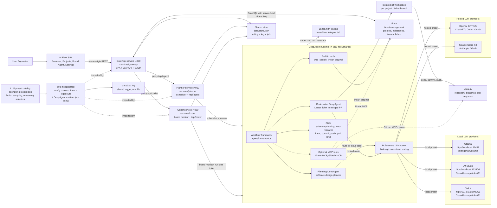
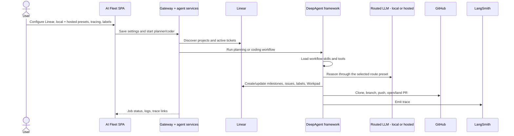

# AI Fleet Architecture Diagram

This diagram shows the preset-routed DeepAgent architecture, decomposed into
**three isolated services over one shared library**: a browser-facing **gateway**
(SPA + user API + OAuth) that reverse-proxies the two isolated agent services
(**planner** and **coder**). Linear is the ticket system, Ollama/LM Studio/OMLX provide
the local route, OpenAI/Claude provide the hosted route, and the DeepAgent runtime
(shipped once in `@ai-fleet/shared`) uses skills plus Linear/GitHub tools to plan
and execute work.

## Request Flow

## Component Notes

- **Linear** is the source of truth for ticket management: projects, issues,
  labels, dependencies, state transitions, and Workpad comments.
- **Ollama**, **LM Studio**, and **OMLX** are local inference providers. OMLX
  discovers models through `GET /v1/models` and supports an optional server-held
  API key. **OpenAI** and **Claude** are hosted providers authenticated with
  OAuth. The planner uses the
  hosted route; the coder selects local or hosted by issue label.
- **The JSON preset catalog** owns model limits, recommended request parameters,
  provider-native reasoning adapters, and effective output/context constraints.
- **DeepAgent skills** improve execution by giving the agent reusable operating
  procedures for planning, Linear updates, commits, pushes, pulls, and landing PRs.
- **Linear and GitHub integrations** are available through built-in tools and
  optional MCP tool groups when enabled.
- **Tracing** uses LangSmith settings and emits trace links from agent jobs.
