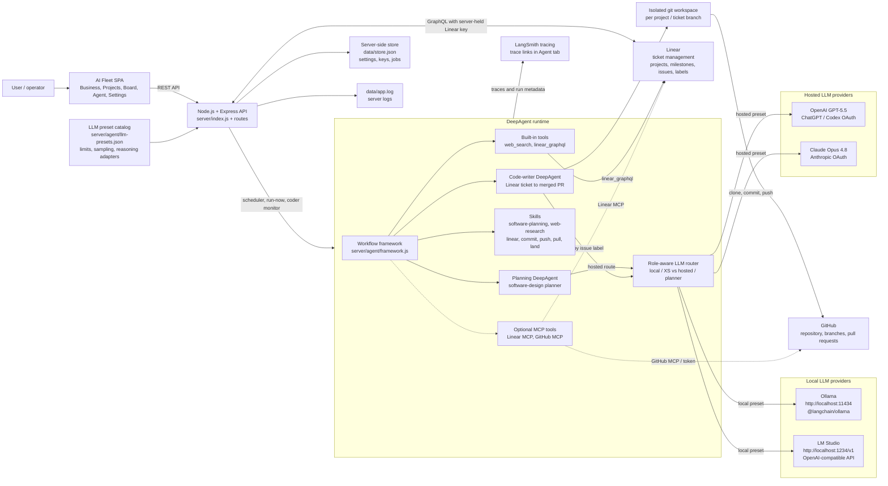
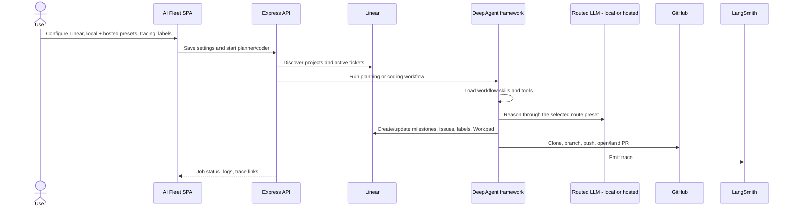

# AI Fleet Architecture Diagram

This diagram shows the preset-routed DeepAgent architecture: Linear is the ticket
system, Ollama/LM Studio provide the local route, OpenAI/Claude provide the hosted
route, and the DeepAgent runtime uses skills plus Linear/GitHub tools to plan and
execute work.

## Request Flow

## Component Notes

- **Linear** is the source of truth for ticket management: projects, issues,
  labels, dependencies, state transitions, and Workpad comments.
- **Ollama** and **LM Studio** are local inference providers. **OpenAI** and
  **Claude** are hosted providers authenticated with OAuth. The planner uses the
  hosted route; the coder selects local or hosted by issue label.
- **The JSON preset catalog** owns model limits, recommended request parameters,
  provider-native reasoning adapters, and effective output/context constraints.
- **DeepAgent skills** improve execution by giving the agent reusable operating
  procedures for planning, Linear updates, commits, pushes, pulls, and landing PRs.
- **Linear and GitHub integrations** are available through built-in tools and
  optional MCP tool groups when enabled.
- **Tracing** uses LangSmith settings and emits trace links from agent jobs.
