# AI Fleet Architecture Diagram

This diagram shows the preset-routed agent architecture. The browser-facing,
SDK-free **gateway** retains browser/domain APIs and proxies isolated agent
services. The rollout-gated durable control plane adds an SDK-free
**orchestrator** plus **tester** and approval-gated **deployer** alongside the
existing **planner** and **coder**. Linear is the ticket system, Ollama/LM Studio/OMLX provide
the local route, OpenAI/Claude provide the hosted route, and the DeepAgent runtime
(shipped once in `@ai-fleet/shared`) uses skills plus Linear/GitHub tools to plan
and execute work.

The browser-local workflow canvas is deliberately not executable. The one
canonical runtime graph is the versioned `plan → code → test → deploy` pipeline;
Firestore PipelineRun/StageRun records and LangGraph checkpoints are its source
of truth. Linear terminal labels are projections, not the control bus.

```mermaid
flowchart LR
  User["User / operator"] --> Browser["AI Fleet SPA<br/>Business, Projects, Board, Agent, Settings"]
  Browser -->|same-origin REST| Gateway["Gateway service :4000<br/>services/gateway<br/>SPA + user API + OAuth"]

  Gateway -->|proxy /api/agent| Planner["Planner service :4010<br/>services/planner<br/>scheduler + /api/agent"]
  Gateway -->|proxy /api/coder| CoderSvc["Coder service :4020<br/>services/coder<br/>board monitor + /api/coder"]

  Gateway --> Store["Shared store<br/>data/store.json<br/>non-secret settings, jobs"]
  Planner --> Store
  CoderSvc --> Store
  Gateway --> StreamProxy["Stream-token proxy sidecar<br/>loopback mint / verify<br/>only holder of signing secret"]
  Planner --> EgressProxy["Egress proxy sidecar<br/>fixed allow-listed routes<br/>credential injection"]
  CoderSvc --> EgressProxy
  SettingsSvc["Settings service<br/>KMS-encrypted org/project vault<br/>managed + customer resolver"] --> EgressProxy
  Shared["@ai-fleet/shared<br/>config · store · linear · logger/util<br/>+ DeepAgent runtime (one copy)"] -.->|imported by| Gateway
  Shared -.->|imported by| Planner
  Shared -.->|imported by| CoderSvc
  Catalog["LLM preset catalog<br/>agent/llm-presets.json<br/>limits, sampling, reasoning adapters"] --> Shared
  EgressProxy -->|GraphQL with selected scope credential| Linear["Linear<br/>ticket management<br/>projects, milestones, issues, labels"]

  subgraph AgentRuntime["DeepAgent runtime (in @ai-fleet/shared)"]
    Framework["Workflow framework<br/>agent/framework.js"]
    PlannerAgent["Planning DeepAgent<br/>software-design planner"]
    CoderAgent["Code-writer DeepAgent<br/>Linear ticket to merged PR"]
    Skills["Skills<br/>software-planning, web-research<br/>linear, commit, push, pull, land"]
    BuiltInTools["Built-in tools<br/>web_search, linear_graphql"]
    McpTools["Optional MCP tools<br/>Linear MCP, GitHub MCP"]
    LlmRouter["Role-aware LLM router<br/>thinking / execution / testing"]

    Framework --> PlannerAgent
    Framework --> CoderAgent
    Framework --> Skills
    Framework --> BuiltInTools
    Framework -.-> McpTools
    PlannerAgent -->|hosted route| LlmRouter
    CoderAgent -->|route by issue label| LlmRouter
  end

  Planner -->|scheduler, run-now| AgentRuntime
  CoderSvc -->|board monitor, run one ticket| AgentRuntime

  subgraph LocalLlm["Local LLM providers"]
    Ollama["Ollama<br/>http://localhost:11434<br/>@langchain/ollama"]
    LmStudio["LM Studio<br/>http://localhost:1234/v1<br/>OpenAI-compatible API"]
    Omlx["OMLX<br/>http://127.0.0.1:8000/v1<br/>OpenAI-compatible API"]
  end

  subgraph HostedLlm["Hosted LLM providers"]
    OpenAI["OpenAI GPT-5.5<br/>org-admin provisioned Codex token"]
    Claude["Claude Opus 4.8<br/>Anthropic OAuth"]
  end

  LlmRouter -->|sentinel / fixed route| EgressProxy
  EgressProxy -->|trusted local target| Ollama
  EgressProxy -->|trusted local target| LmStudio
  EgressProxy -->|trusted local target| Omlx
  EgressProxy -->|injected hosted credential| OpenAI
  EgressProxy -->|injected hosted credential| Claude

  BuiltInTools -->|linear_graphql sentinel| EgressProxy
  McpTools -.->|MCP sentinel| EgressProxy

  CoderAgent --> Workspace["Isolated git workspace<br/>per project / ticket branch"]
  Workspace -->|credential-helper sentinel| EgressProxy
  EgressProxy -->|clone, push, API| GitHub["GitHub<br/>repository, branches, pull requests"]

  AgentRuntime -->|traces and run metadata| Observability["LangSmith tracing<br/>trace links in Agent tab"]
  Shared --> Logs["data/app.log<br/>shared logger, one file"]
```



## Request Flow

```mermaid
sequenceDiagram
  actor User as User
  participant UI as AI Fleet SPA
  participant API as Gateway + agent services
  participant Linear as Linear
  participant Agent as DeepAgent framework
  participant LLM as Routed LLM - local or hosted
  participant GitHub as GitHub
  participant Obs as LangSmith

  User->>UI: Select scope; configure vault, connectors, presets, tracing
  UI->>API: Save masked scope settings and start planner/coder
  API->>Linear: Via egress proxy, discover projects and active tickets
  API->>Agent: Run planning or coding workflow
  Agent->>Agent: Load workflow skills and tools
  Agent->>LLM: Reason through the selected route preset
  Agent->>Linear: Create/update milestones, issues, labels, Workpad
  Agent->>GitHub: Clone, branch, push, open/land PR
  Agent->>Obs: Emit trace
  API-->>UI: Job status, logs, trace links
```

## Component Notes

- **Linear** is the source of truth for ticket management: projects, issues,
  labels, dependencies, state transitions, and Workpad comments.
- **Ollama**, **LM Studio**, and **OMLX** are local inference providers. OMLX
  discovers models through `GET /v1/models` and supports an optional server-held
  API key. **OpenAI** and **Claude** are hosted providers authenticated with
  OAuth. The planner uses the
  hosted route; the coder selects local or hosted by issue label.
- **The JSON preset catalog** owns model limits, recommended request parameters,
  provider-native reasoning adapters, and effective output/context constraints.
- **DeepAgent skills** improve execution by giving the agent reusable operating
  procedures for planning, Linear updates, commits, pushes, pulls, and landing PRs.
- **Linear and GitHub integrations** are available through built-in tools and
  optional MCP tool groups when enabled.
- **Tracing** uses LangSmith settings and emits trace links from agent jobs.
