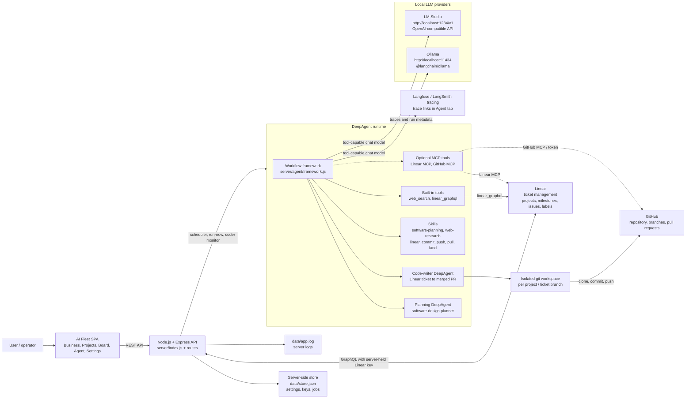
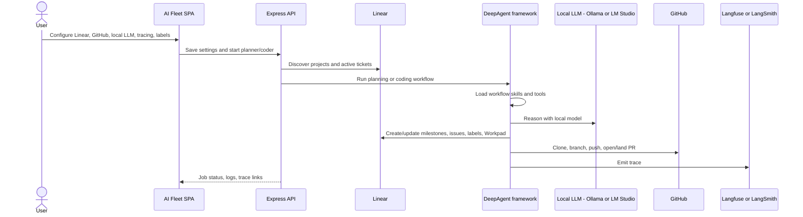

# AI Fleet Architecture Diagram

This diagram shows the local-first DeepAgent architecture: Linear is the ticket
system, Ollama and LM Studio provide local LLM inference, and the DeepAgent
runtime uses skills plus Linear/GitHub tools to plan and execute work.

## Request Flow

## Component Notes

- **Linear** is the source of truth for ticket management: projects, issues,
  labels, dependencies, state transitions, and Workpad comments.
- **Ollama** and **LM Studio** are local inference providers. They require a
  tool-capable model and no hosted LLM API key.
- **DeepAgent skills** improve execution by giving the agent reusable operating
  procedures for planning, Linear updates, commits, pushes, pulls, and landing PRs.
- **Linear and GitHub integrations** are available through built-in tools and
  optional MCP tool groups when enabled.
- **Tracing** is represented as Langfuse/LangSmith-compatible observability. The
  current codebase stores LangSmith settings and emits trace links from agent jobs.
