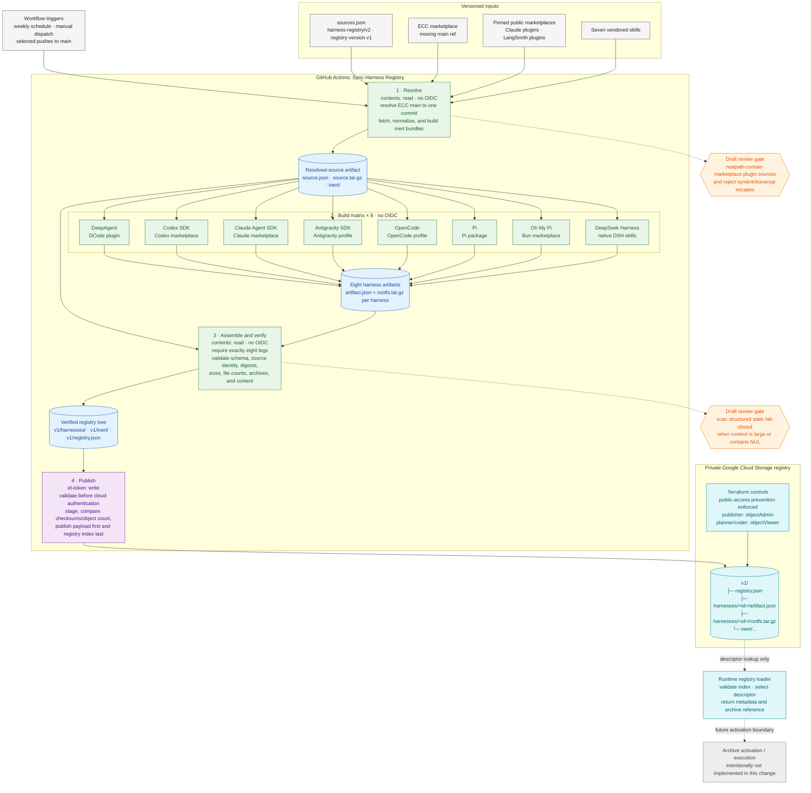

# Harness Registry v2 Implementation Diagram

The registry pipeline resolves moving external inputs once, builds eight
harness-native filesystem trees without cloud credentials, verifies their
shared source identity, and grants cloud identity only to the final publisher.

## Security and delivery invariants

- The resolve job converts ECC's moving `main` ref into one immutable commit;
  every matrix leg must report that same source identity.
- Jobs that fetch or execute third-party installers have no `id-token`
  permission and therefore cannot mint Google Cloud credentials.
- The DeepSeek leg pins the official `dsh` CLI, validates its version, and
  stages only native `SKILL.md` bundles; credentials and mutable profile state
  are never included in the artifact.
- The publish job receives only assembled bytes, validates them before
  authenticating, verifies the staged copy, and writes `registry.json` last.
- Terraform keeps the bucket private and separates publisher write access from
  planner/coder read access.
- The runtime loader stops at validated metadata selection. Extracting or
  executing a selected archive remains a separate, future trust boundary.
- The orange nodes are known review gates on the draft pull request and must be
  closed before the implementation is marked ready to merge.
