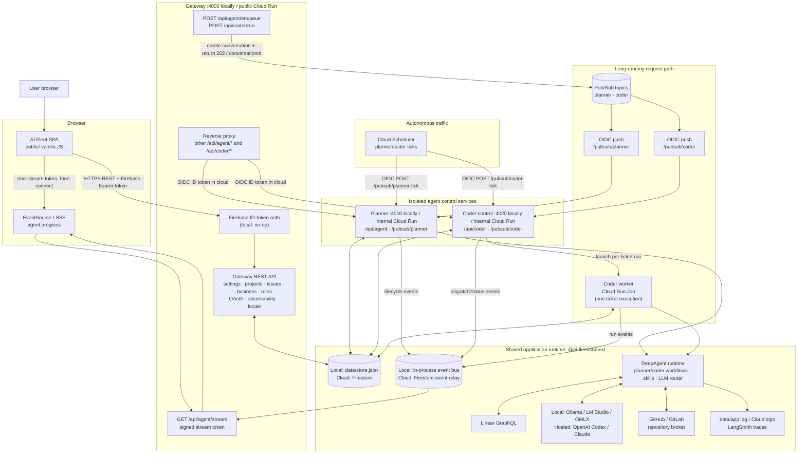
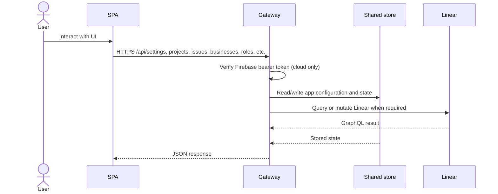
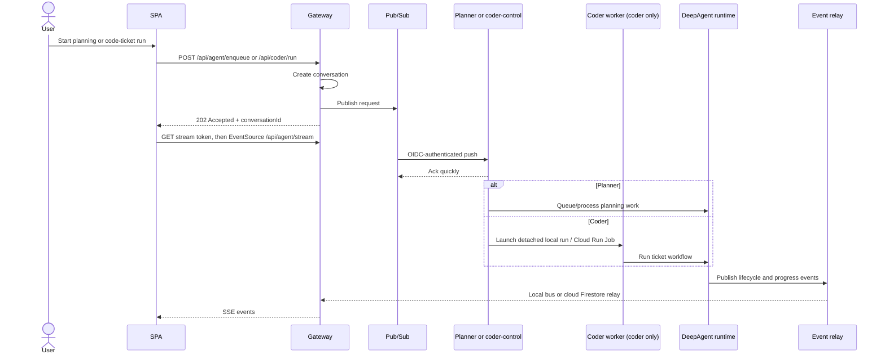
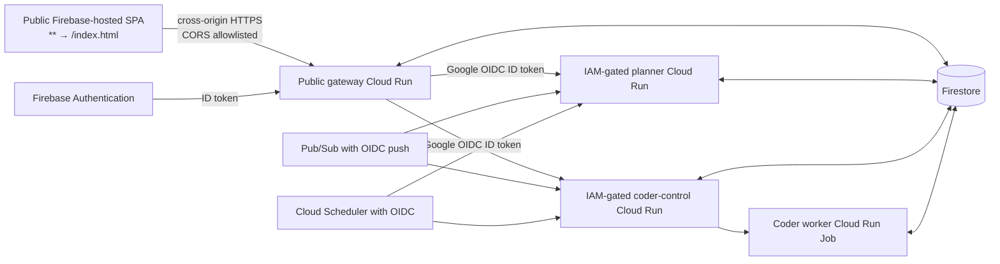

# Current Request & Traffic Flow

This diagram describes both deployment modes: local development (direct service calls and a JSON store) and the deployed Google Cloud path (Firebase Hosting SPA, Cloud Run, Pub/Sub, Firestore, and Cloud Run Jobs).

## Request paths

### Standard browser reads and writes

### Agent submission and streamed progress

### Cloud-only ingress and service boundary

